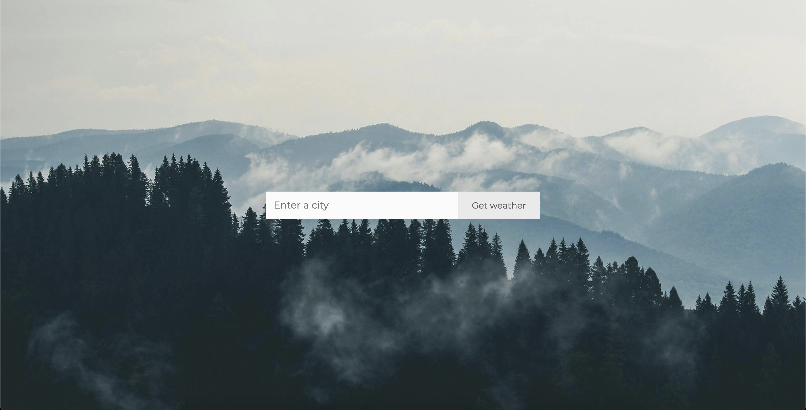

# Weather App

A React + TypeScript application that fetches and displays current weather data by city name, featuring dynamic background images from the Pexels API.

---

## About

This app uses the **OpenWeatherMap API** as the primary source of weather data. 
The app also dynamically fetches related background images from the **Pexels API** to enhance the user experience.

---

## Features

- Search weather by city name
- Toggle temperature units (°C / °F)
- Display temperature, feels like, wind speed, weather description, and icon
- Automatic fetching and setting of a city-related background image
- Error handling

---

## Tech Stack

- **TypeScript**
- **React**
- **CSS**
- **HTML**

---

## Development Roadmap

- Add **hourly** and **daily** weather forecasts
- Implement **geolocation** functionality (so you don’t have to enter your city manually every time)
- Improve UI/UX with responsive design

---

## Installation & Setup

1. Clone the repository: git clone https://github.com/yourusername/weather-app.git
2. Install dependencies: npm install
3. Create a .env file in the project root and add your API keys from https://www.pexels.com/ and https://openweathermap.org/:

`VITE_APP_WEATHER_API_KEY=your_openweather_api_key`
`VITE_APP_PEXELS_API_KEY=your_pexels_api_key`
4. Run the server: npm run dev

---

## Screenshots

  
  
  

